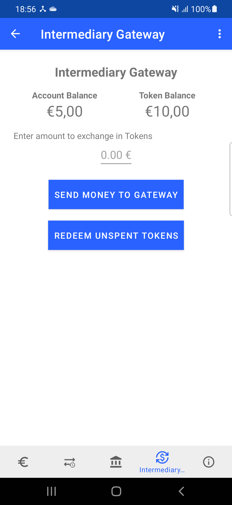
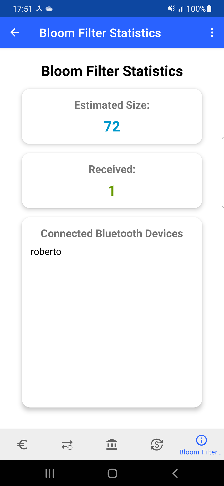
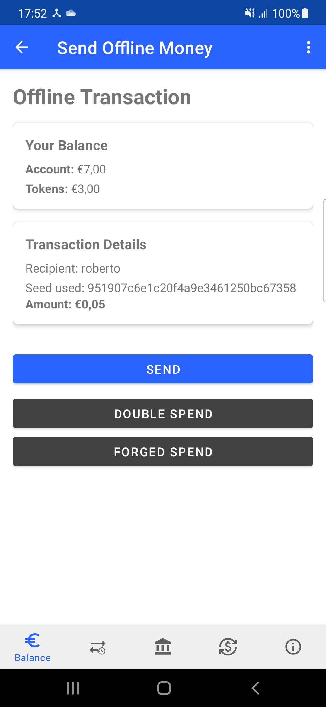
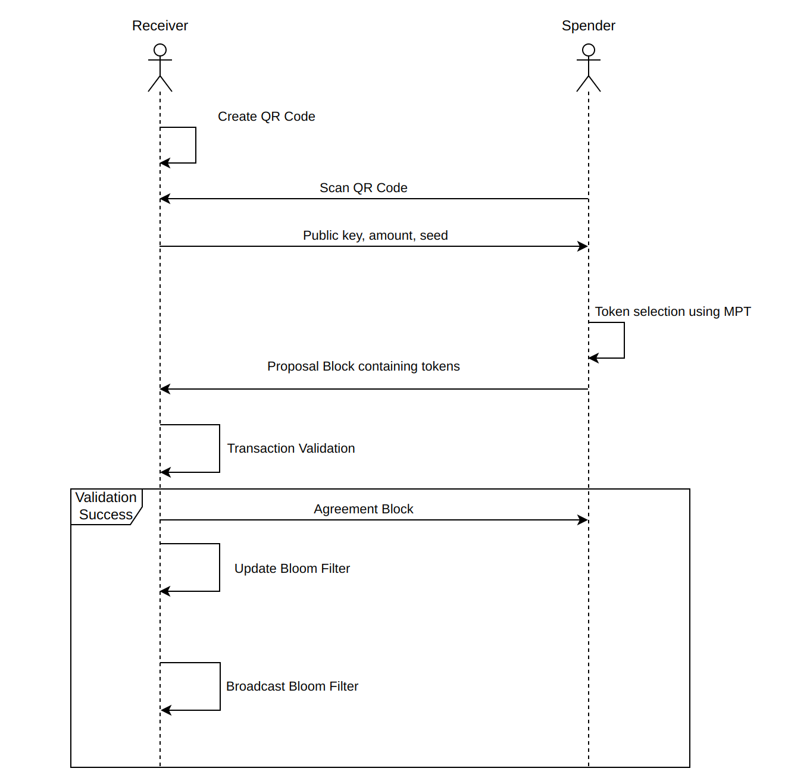

# EURO 3 Team 3 — Offline Double-Spending Prevention
Previously, the EuroToken app made no distinction between online and offline payments, and no mechanism was in place to **prevent** double-spending. Instead, a form of *mitigation* was in place through a 'web of trust' mechanism that tracked known counterparties’ public keys. This 'web of trust' was merely a form of mitigation because it was a reactive system; it couldn't prevent double-spending in real time, but could only punish an offender's reputation after the fraud had already been committed and discovered.

With this project, inspired by the work described in [_Ad Hoc Prevention of Double-Spending in Offline Payments_](https://www.techrxiv.org/users/901695/articles/1277252/master/file/data/Ad%20Hoc%20Prevention%20of%20Double-Spending/Ad%20Hoc%20Prevention%20of%20Double-Spending.pdf?inline=true), we propose a new payment protocol specifically designed to prevent double-spending in **offline environments** (no access to Wi-Fi or mobile data). This new protocol is more effective because it provides a concrete prevention mechanism, leveraging data structures like Bloom filters for fraud detection and Merkle Patricia Tries to ensure fair token selection, instead of relying on abstract reputation.

## Key Features
- To be able to make offline payments, users must convert their online EuroTokens into **offline tokens**. This is done via a **withdrawal operation** through a trusted intermediary. Conversely, offline tokens can be redeemed and converted back into regular currency either by **explicitly redeeming them with the intermediary**, or by **completing an offline payment**, after which the recipient's funds are automatically translated back to the online representation.

- Offline money is represented as tokens with **unique spending identifiers**, allowing each transaction to be linked to a unique, verifiable unit of value. This prevents reuse of the same token across multiple payments.

- To detect double-spending, a **Bloom filter** is broadcast at the end of each transaction to nearby peers. This data structure contains the set of previously spent tokens and is later used to validate incoming payments.

- Instead of allowing the sender to freely choose which tokens to spend (which would enable strategic hiding), token selection is performed by traversing the payer’s **Merkle Patricia Trie (MPT)** in a fixed order determined by a seed created by the receiver. 
    

## Withdrawal and token representation

### Intermediary
The below screenshot shows the intermediary fragment. The objective of this fragment is to allow the user to comunicate with the **intermediary**. The latter should be a trusted third party that can exchange the **Online Account based** money with **Offline Token based** money. In our implementation this intermediary is represented by the **gateway** as we do not have access to a realistic third party. More in detail our conversion process is done by creating **proposal** blocks of **type withdrawal** with the gateway (similar to how the checkpoint blocks are created). These proposal block we create contain the total amount of money we are converting, together with the actual tokens that we are receiving/redeeming. For our simplified implementation there is never going to be an **agreement** withdrawal block as this would need the realistic intermediary. Functionality wise as the picture below suggests, we either input the value of money we want to transfer to tokens and press *SEND MONEY TO GATEWAY*, or we have unspent tokens that we don't need/want anymore so we press *REDEEM UNSPENT TOKENS*.

  

### Token Representation
The intermediary is responsible for creating **tokens** and to do so it needs to include the following information:
- **unique ID** - composed using peer's Id and a nonce (timestamp of creation)
- **value** of token in cents (5 cents in our case)
- **signature** of the intermediary
- creation date

These values are then used to check the validity of tokens during a transaction. More in detail, the token's id are included in a bloom filter so that when a transaction is happening, the receiver can check if the received tokens have not been already spent. Another important check is the signature; this allows the user to check that the tokens received actually come from the intermediary, and so they have not been forged. Finally the value of the token simply shows what value they represent and so what is the total of a transaction by summing their values.

## Data Structures

The security of the offline payment protocol is centered around two key data structures: Bloom Filters and Merkle Patricia Tries (MPTs), which work together to make transactions both secure and efficient.

### Bloom Filteres

The Bloom filter (BF) is a space-efficient, probabilistic data structure used to track the identifiers of spent tokens. After a transaction, the spent token IDs are added to the user's local filter, which is then broadcast to nearby peers. The system employs a merging strategy where filters from peers are aggregated into a user's own, creating a powerful, "*shared memory*" of spent currency. This collaborative approach enhances the accuracy of double-spend detection and helps maintain a low false-positive rate across the local network. 

  

The application includes a dedicated interface where users can monitor the status and capacity of their filters, offering insight into the real-time operation of this prevention mechanism.

With this mechanism, the receiver's device can quickly check incoming tokens against this aggregated knowledge, allowing it to instantly detect and reject a double-spend attempt.

### Merkle-Patricia-Trie

Complementing the BF use is the Merkle Patricia Trie (MPT), which ensures a fair and verifiable token selection process. To prevent a malicious sender (payer) from strategically choosing which tokens to spend, the selection is made deterministic by a random seed generated by the payment receiver. The payer uses this seed to traverse their MPT of unspent tokens in a fixed, verifiable order to gather the funds. The process can be broken down as follows:

 * **Receiver-Generated Seed**: The core of this security feature is that the process is initiated by the payment receiver, who generates a random seed and includes it in the QR code. This transfers control of the selection away from the potentially malicious payer.

 * **Seeded Traversal**: The payer is obligated to use this seed to guide the token selection from their wallet. The seed is used to deterministically shuffle the order of the MPT's branches. This means that for any given wallet state and seed, the path taken through the trie is fixed and predictable.

 * **Unbiased and Verifiable Outcome**: Selection process is both transparent and secure since the sender cannot influence the path to select specific tokens. This removes the attack vector of strategic selection and ensures the transaction is fair and its inputs are independently verifiable.

> Note: our current integration of the MPT in the codebase is simplified. It does not yet dynamically adapt the trie's structure after each withdrawal or spend, as envisioned in the original paper. A full integration to leverage the MPT's complete potential is possible but would require further code modifications.

## Offline Transaction
The transaction begins when the **receiver**, operating offline, creates a QR code. This offline QR code  contains the same information as its online version(public key, requested amount, name), but also includes a **seed**. This seed will be used by the sender to run the algorithm used to select which tokens to include in the transaction

Once the **sender** scans this QR code, the app presents a summary screen showing the transaction details. Here, the sender has three available options:
- A normal **SEND**, which selects a valid subset of unspent tokens based on the received seed.
- A **DOUBLE SPEND**, which attempts to reuse tokens that have already been spent in previous transactions.
- A **FORGED SPEND**, where the sender tries to include invalid tokens, for example, tokens never issued by the trusted intermediary.

  

In all cases, the sender constructs a **Proposal Block** of type `OFFLINE_TRANSFER`.
The Proposal Block is then sent to the receiver, who proceeds to validate the transaction:
- Tokens are deserialized and their signatures are verified.
- The total value is checked to ensure it satisfies the requested amount.
- The receiver checks that none of the tokens have already been received, either in previous transactions (via the local token database) or by others (via the Bloom filter).

If validation succeeds, the receiver sends back an **Agreement Block**, finalizing the transaction. The sender’s token balance is updated, and the receiver’s online balance increases. The received tokens are also added to the Bloom filter and broadcast to surrounding peers.

